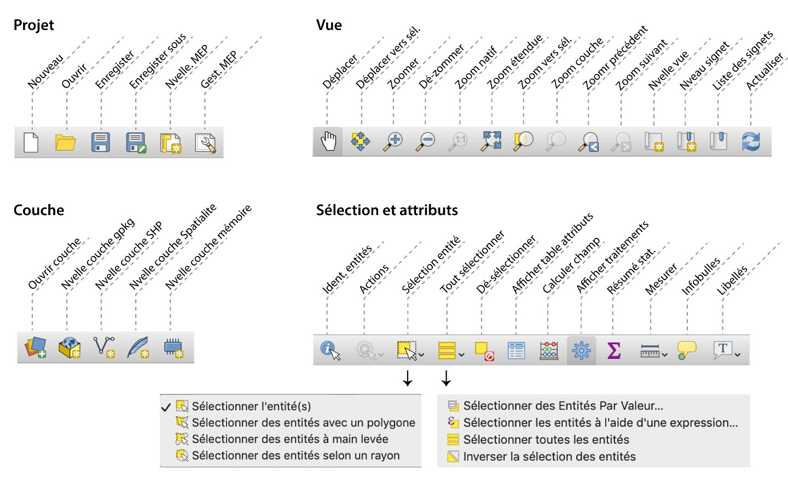

[**QGIS**](http://qgis.org "qgis.org"), appelé à l'origine *Quantum-GIS*, est le logiciel **libre et gratuit** de système d’information géographique (SIG) le plus complet disponible actuellement.

Il est multi-plateforme (Windows/Mac/Linux) et est proposé dans de nombreuses langues, dont le français.

Un système de greffons (*plugins*, en python), disponibles via des sites de distribution sécurisée en ligne, permet d’étendre facilement ses possibilités dans de très nombreux domaines.

Il est actuellement (mars 2022) disponible en version **3.24**, mais on peut préfèrer utiliser une version « LTR » (*long term release* plus stable, mise à jour à long terme), la 3.22.4.

# Interface du logiciel
QGIS se présente sous la forme d'une application assez classique, avec un écran de travail proposé par défaut comme sur la capture d'écran ci-dessus.
On trouve, outre la barre de menus, plusieurs barres d'icônes (selon les plugins installés et les opérations en cours), dont les fonctions apparaîssent au survol de la souris, mais on en a regroupé les plus courantes dans l'illustration ci-après.

## Fonctionnement général

QGIS fonctionne sur la base de **projets**, qui vont permettre d'enregistrer des *sessions de travail sur les données*. Ainsi, chaque projet va contenir les liens vers les données ou leurs sources distantes, les styles qui leur sont appliqués (notamment pour en faire des cartographies), les filtres ou sélections réalisées, pour les sauvegarder dans un fichier projet. Ces fichiers pourroont permettre de facilement retrouver un espace de travail enregistré.

*Attention*, les projets ne contiennent pas de données, mais des liens vers des données existantes. Si vous désirez transférer un projet entier, il faut regrouper le fichier de projet et les fichiers ou répertoires de données.

Un projet est réglé, de plus, sur un *système de projection* particulier. Les données qu'il utilise sont donc, si besoin, reprojetées à la volée dans ce système, ce qui peut parfois ralentir les opérations ou provoquer des distorsions locales, si les deux systèmes sont trop éloignés. Nous reparlerons des systèmes de projection dans le chapitre sur les données spatiales.