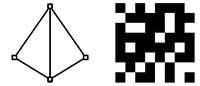
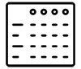

**Toujours deux composantes**

* La **géométrie** (des formes diverses dans l’espace géographique)
* Les **attributs** (des informations sur ces formes, au minimum un identifiant, potentiellement des données statistiques associées)

Les données spatiales se répartissent ensuite en **deux grands types numériques**

* Les données **vectorielles** (formes géométriques)
* Les données **carroyées ou raster**, matricielles (pixels)

On ne prend généralement pas en compte, dans cette définition, les données à composante spatiale ne possédant pas de partie graphique, par exemple les tables de données uniquement *alphanumériques* (nombres et textes) comprenant un code géographique ou des colonnes de coordonnées (un exemple de telles données sera utilisé plus loin).