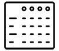
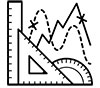
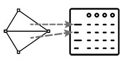

## Les attributs

L'aspect le plus habituel des données spatiales numériques c'est qu'elles sont munies d'attributs, des informations :

* Liées aux parties géométriques, graphiques des données par des identifiants uniques
* Qui peuvent se présenter sous forme de tables classiques (objets, entités en lignes, champs en colonnes)

➜ Les tables d'attributs sont donc les équivalents des tables de base de données (ou de feuilles de calcul structurées)

On va pouvoir les utiliser comme les tables de bases de données, par exemple pour y rechercher des objets qui correspondent à certains critères (requêtes).

## La géométrie

L'originalité des données spatiales se trouve dans leur aspect géométrique, composé de vecteurs (formes) ou de pixels (points). Ces caractéristiques correspondent à leur rôle de représentation d'une entité géographique, qui est **localisée** et **dimensionnée** dans l'espace.

Toute la complexité des systèmes d'information géographique va consister à savoir *gérer correctement et complètement ces données*, dans leur rapport à la réalité géographique, et à proposer des outils pour leur traitement, leur croisement et leur analyse, qui préservent leurs propriétés géographiques. Les propriétés spatiales de ces données vont donc pouvoir être intégrées au système de gestion (qui prend souvent la forme d'une base de données).

## La prise en compte de ces deux aspects

Les SIG sont donc **des bases de données spatialisées**, qui vont permettre à la fois  de gérer correctement les données (insertion, stockage sécurisé, mises à jour facilitées), mais aussi leur prise en compte dans des processus d'analyse et de traitement : filtrage ou recherche d'information, croisement de différentes sources, création de nouvelles données, et, enfin, de représenter cartographiquement les résultats de ces travaux (cartes, schémas, vues 3D...) et les diffuser, communiquer.