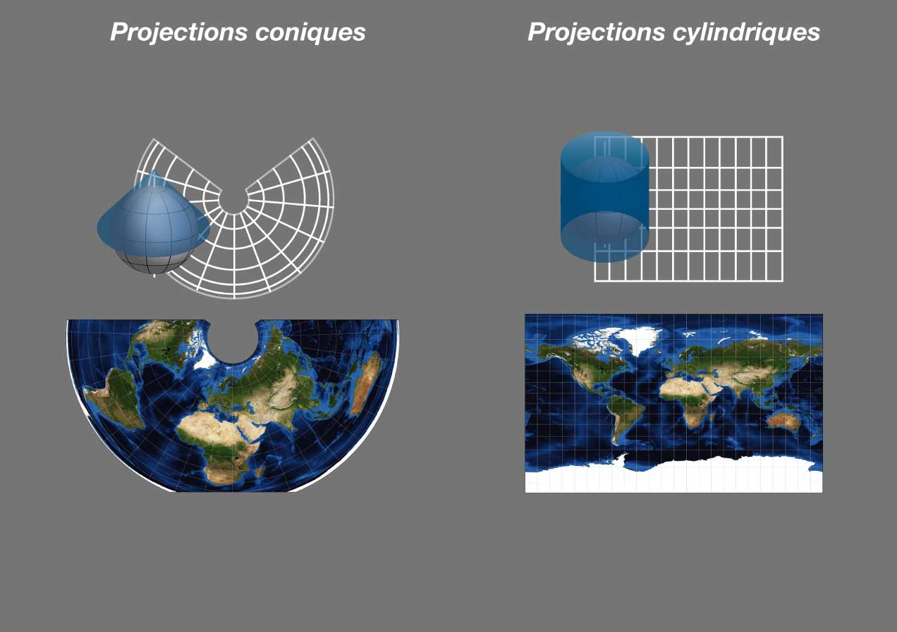
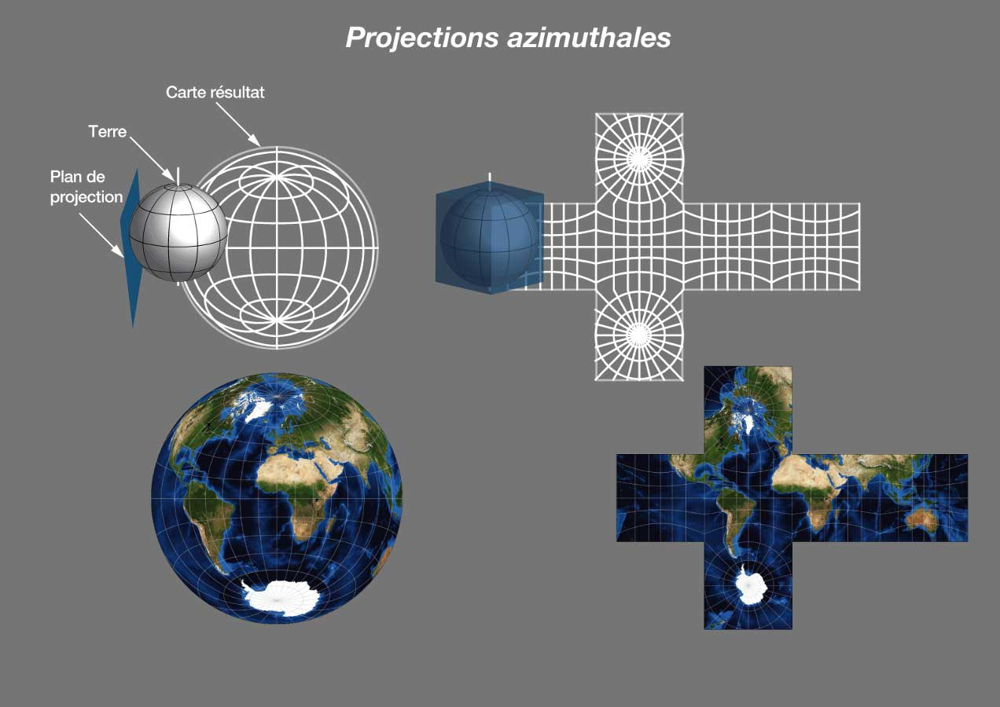
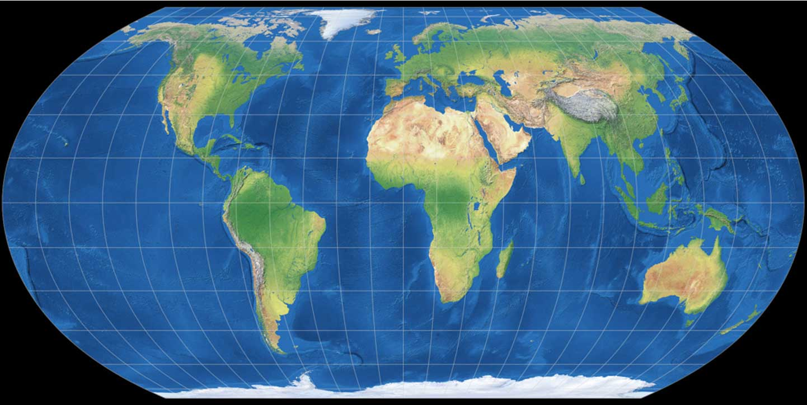
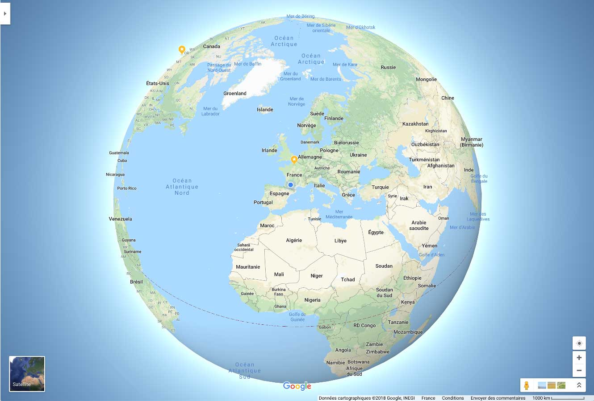

Les projections sont les fonctions qui permettent de transformer des coordonnées géographiques (longitude et latitude, donc angulaires) en des positions sur un plan en deux dimensions, comme sur les écrans ou les cartes papier. Il n'est en effet pas possible de présenter correctement la Terre sphérique sur une image plane, il faut donc utiliser des transformations géométriques, qui vont provoquer différentes déformatinos ou décalages.

Très souvent, les données spatiales sont fournies avec des coordonnées exprimées dans un système de projection ou un autre, sinon au moins dans un système de référence spatiale de base qui permettra leur projection (un modèle de la Terre qui possède certaines dimensions et unités de mesure).

Voici, rapidement, les principales familles de projections.

Les projections les plus courantes pour les cartes à grande échelle sont souvent de la famille des coniques, par exemple Lambert-93 en France. Aux États-Unis, ce sont des cylindriques qui ont été choisies (UTM).

Pour certains usages, notamment les images satellite, des projections azimuthales sont utilisées.

Quand l'objectif est de produire une carte de communication, qui soit *juste* dans sa présentation des tailles et des formes de la géographie, il faut faire attention à utiliser une projection adaptée. Trop souvent, on voit encore des erreurs dans ce domaine, notamment des données spatiales qui ne sont pas reprojetées (Mecator, par exemple) et produisent des cartes déformées (comme des mappemondes où le Groënland est aussi massif que l'Afrique... lors qu'il est d'une surface équivalente à l'Algérie).

Récemment, des collègues ont mis au point une projection très équilibrée pour représenter les mappemondes ou les cartes à petite échelle, la projection ["Equal Earth"](http://equal-earth.com/).

Source : Tom Patterson

Enfin, avec l'évolution des techniques, la possibilité de se passer de projection pour utiliser *directement* un globe interactif, manipulable sur son écran, dans un navigateur, est récemment devenue possible (2018), par exemple avec la célèbre application web Google Maps.