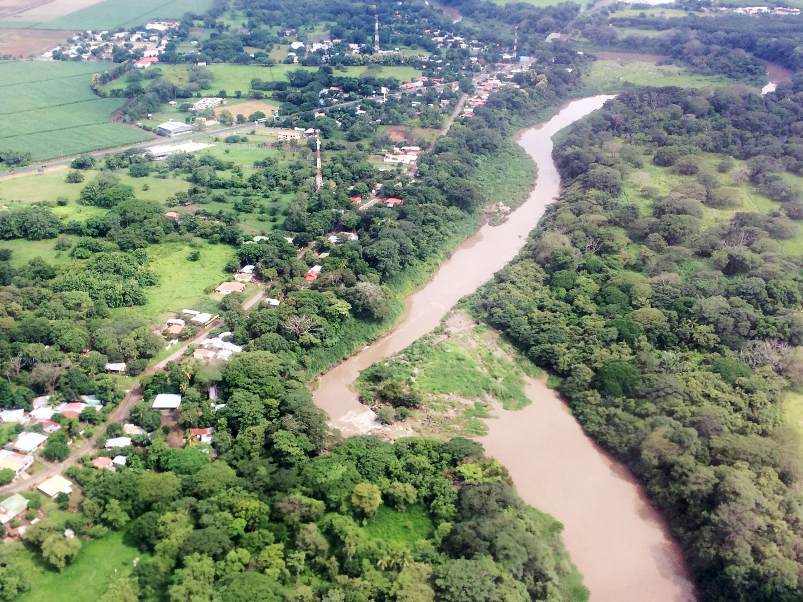
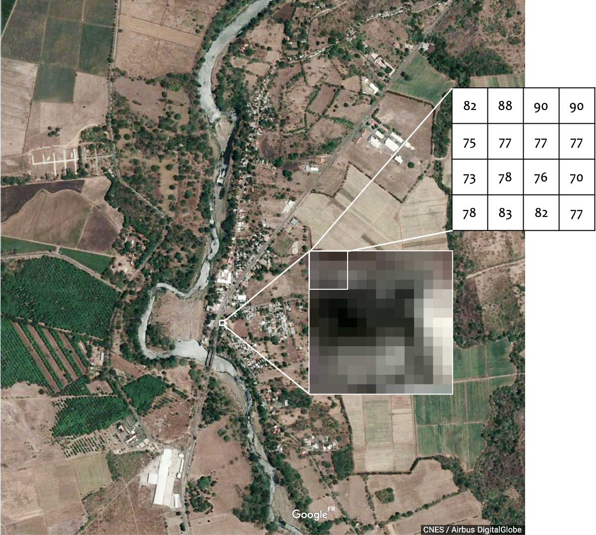
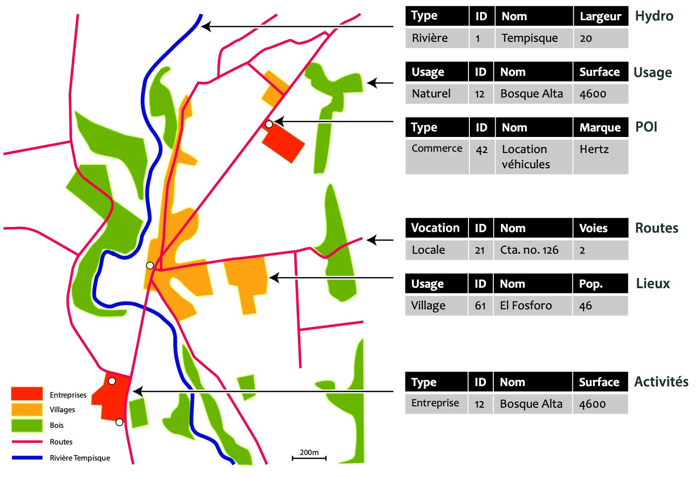

## Le territoire visible : photographie aérienne oblique
La réalité : photographie aérienne à proximité de Liberia, au Costa-Rica

[Source](https://www.flickr.com/photos/144957155@N06/37678008844/)

## Sous la forme de données raster
Une image satellite en couleurs "naturelles".

## Sous la forme de données vectorielles
Une couche géométrique avec ses entités et leurs arttibuts.
