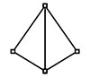
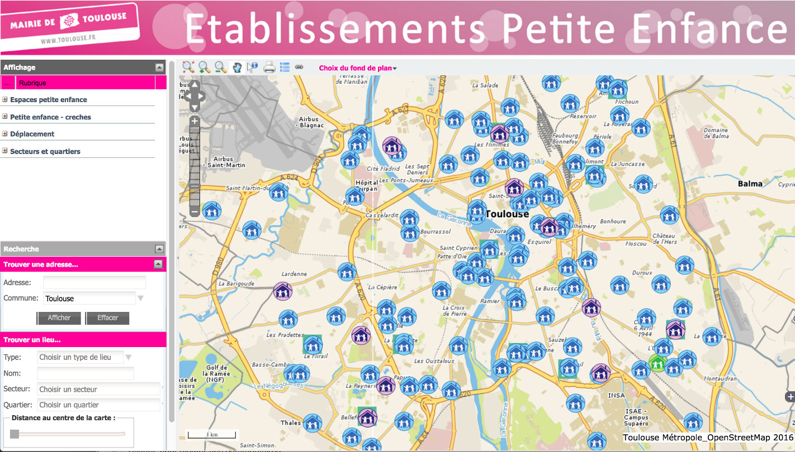
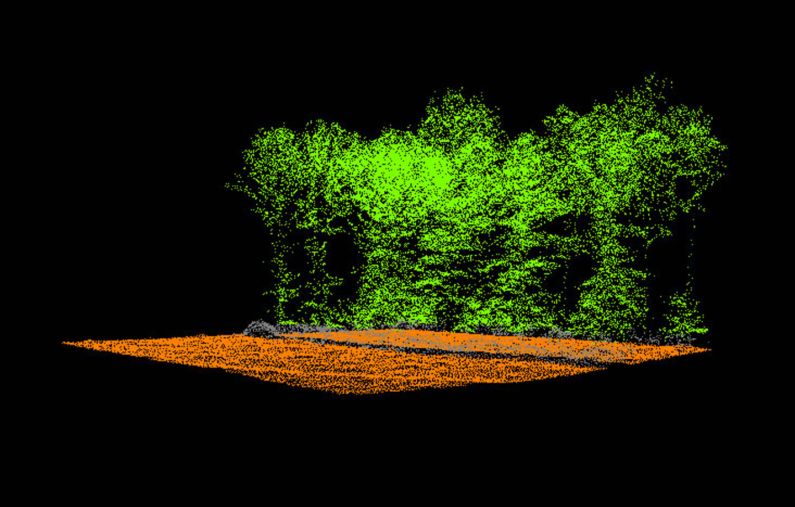
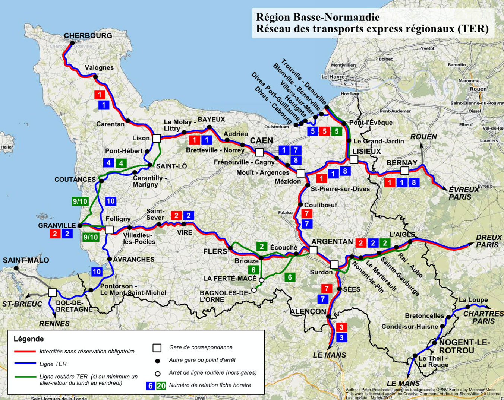
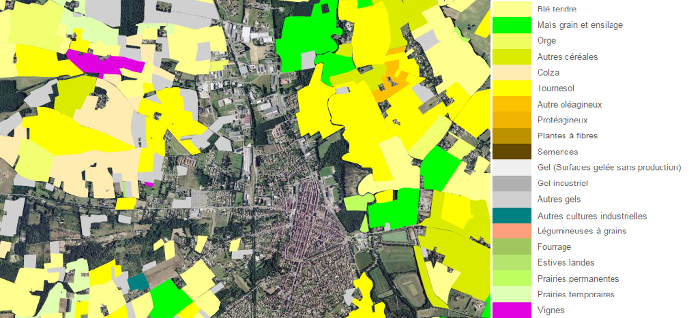
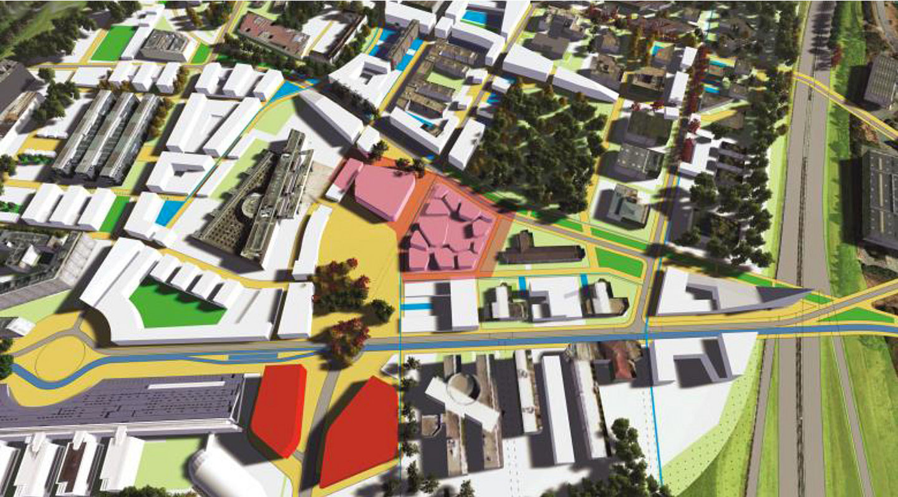
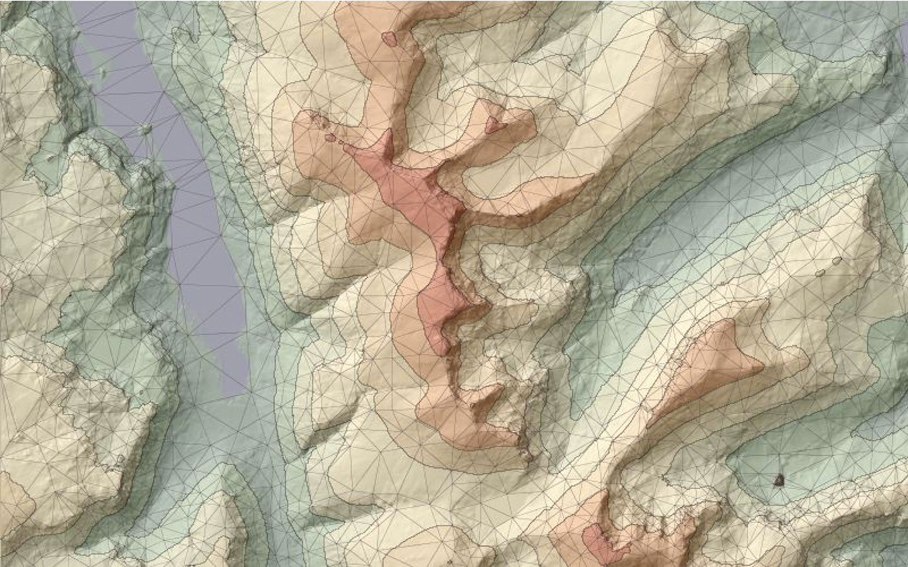

# Quelques exemples

## Des points, ici les établissements accueillant les enfants à Toulouse
Source : Mairie de Toulouse

Les établissements (crèches, garderies), sont représentés par un pictogramme qui est localisé sur un point, positionné sur le fond de carte des rues de la ville. Les données vectorielles correspondent donc à un couple de coordonnées géographiques accompagné de données attributaires (nom de l'établissement). 

## Des points, en 3D, ici un relevé Lidar de l'orée d'une forêt
Source : Gembloux agrobiotech, Université de Liège

Les points sont ici en 3D, avec une position et une élévation des coordonnées géographiques, ce qui permet de réaliser une vue oblique. Les données sont produites par des relevés Lidar (laser), technique récente qui est beaucoup utilisée pour les travaux publics, l'archéologie...

## Des lignes, ici un réseau régional de transports en commun simplifié
 Source : OPNV Karte, Melchior Moos

Les données vectorielles linéaires permettent de représenter des réseaux de lignes, par exemple de transports routiers. Elles se composent de séries de points en 2D reliés et munis d'identifiants, éventuellement de données attributaires. Souvent, les points sont triés dans le sens de la ligne. On appelle aussi ces données des *polylignes*.

## Des polygones 2D, ici des parcelles de culture
 Source : RPG, GéoPortail IGN

Les polygones correspondent à des polylignes fermées, dont le dernier point se confond avec le point de départ. Selon les formats, les polygones peuvent comporter des trous (par exemple pour des lacs dans un territoire) ou des formes multiples (par exemple pour un département qui comporte des îles). Dans ce dernier cas, on parle de *multipolygones*.

## Des polygones 2,5D (élévation simple), ici le bâti simplifié
 Source : IAURIF

Lorsque les polygones possèdent un attribut correspondant à une élévation, une hauteur, on peut les représenter sous la forme de polyèdres. Même s'ils sont effectivement en trois dimensions, ces polygones ont pris la dénomination de "2,5D" car la troisième dimension est simplifiée par rapport à la réalité.

## Des polygones en 3D, ici une triangulation du relief

Source : The 50m Panorama DEMs covering the English Lake District, Crown Copyright, Ordnance Survey

Enfin, la vraie 3D peut correspondre, par exemple, à un réseau irrégulier de triangles (TIN ou *Triangular Irregular Network* en anglais), au lieu de polygones complets en 3D..