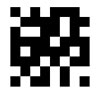
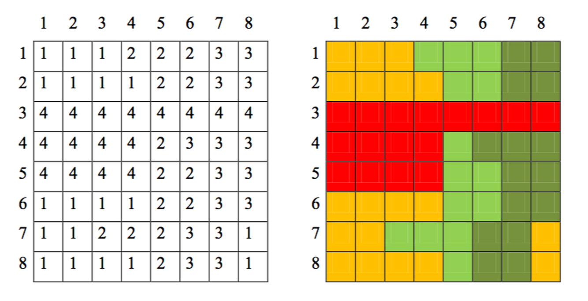
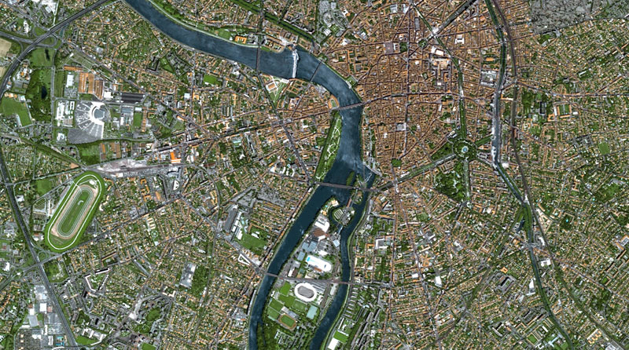
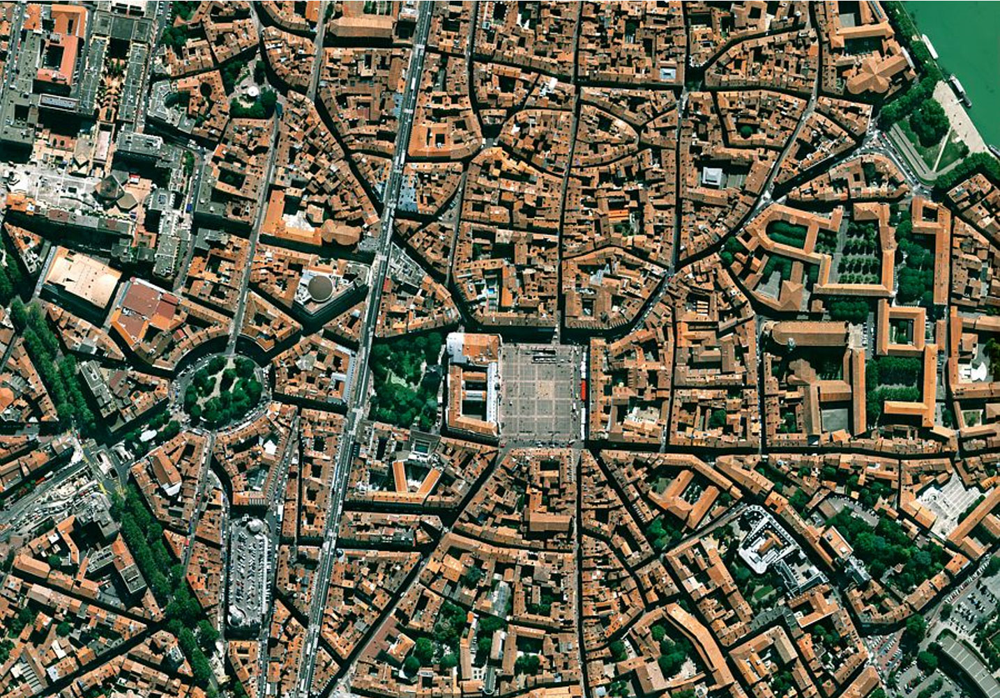
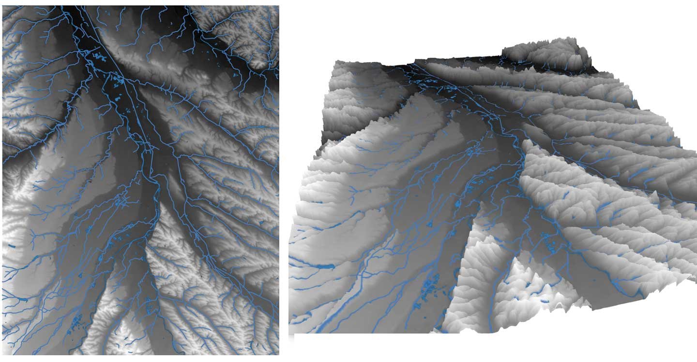
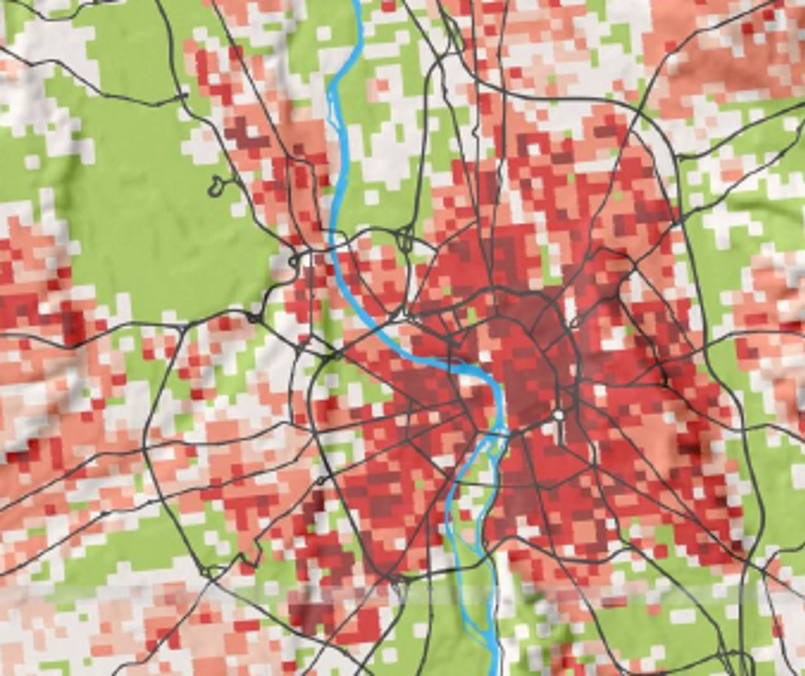

# Les données carroyées, ou raster

Comme on l'a vu dans l'exemple introductif, les données raster sont composées de **pixels** (contraction de *picture elements* en anglais, soit : éléments d'image).

Ces pixels sont dotés :

* d’une *position* dans l’espace
* de *dimensions* (largeur et hauteur, carrés ou rectangles)
* d’une *valeur numérique* (quantitative ou qualitative : couleur, radiosité, altitude, énergie, type d’occupation du sol, etc.)

Ces données sont souvent disponibles en groupes de plusieurs *canaux*, Rouge+Vert+Bleu par exemple pour des couleurs "naturelles" d’une prise de vue aérienne ou satellite (qui ressemble alors à une photographie aérienne), mais aussi infrarouge (pour la surveillance de cultures) ou d'autres longueurs d'onde comme dans le domaine radar (pour le relief).

Les attributs des pixels sont donc contenus dans la valeur associée à chaque couche. Le pixel d'une image aérienne verticale en couleurs naturelles possédera ainsi des attributs dans les canaux R, V et B. Les couleurs que l'on associe aux valeurs sont arbitraires, on peut simplement changer de "palette" pour faire varier la représentation.

Les valeurs des pixels peuvent aussi, par exemple, correspondre à des qualités, comme un type d'occupation du sol ou de culture.

# Quelques exemples

## Une image satellite

Image du satellite SPOT5, Toulouse en 2002, traitée en couleurs "naturelles", donc avec 3 canaux RVB, source : CNES / Aibus Defense and Space. La résolution est de 2,5m par pixel.

## Une photographie aérienne

Photographie verticale du centre de Toulouse en 2012, source CNES. La résolution est d'environ 50cm.

## Un modèle numérique de Terrain

MNT de la région autour de Toulouse, superposé au réseau hydrologique, en vue verticale et oblique (planche ralisée avec l'outil "vue 3D" de QGIS 3). Source IGN. La valeur numérique des pixels correspond à l'altitude du centre du carré, le logiciel utilise cette information pour produire une vue verticale ou oblique 3D, colorée selon une palette qui affecte la valeur de hauteur à une nuance dans un dégradé.

## Un carroyage de données statistiques

Données carroyées de densité de population en 2010, source INSEE, réalisation AUAT, 2014.

Ici, les données statistiques de la population sont converties en couleurs selon une palette. Ce format de données permet à l'INSEE de produire des statistiques à une échelle infracommunale fine qui s'affranchit des limites administratives et des unités de recensement (les IRIS). Les problèmes de perception dus à la taille variable des unités administratives sont donc contournés (MAUP : *Modifiable Areal Unit Problem* en anglais). On utilise ces carroyage notamment pour étudier les revenus localisés (fichiers FILOSOFI).

