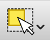

Un dossier compressé de données d'exemple libres est mis à disposition : 
[http://www.geotests.net/cours/urfist/QGIS/](http://www.geotests.net/cours/urfist/QGIS/?target=blank)

### Données vectorielles au format shape (.shp, source IGN)
* polygones :
	* epci_mp21 : Contours des EPCI de Midi-Pyrénées
	* epci_mp21_ctr : Centres des EPCI de Midi-Pyrénées
* points :
	* piscines_mp : piscines publiques
	* ecoles_mp : écoles primaires publiques
* lignes :
	* routes_mp : routes carrossables (de l’autoroute à la voie communale)

### Données raster
* LC81990302015334LGN00 : image Landsat-8 en fausses couleurs, Toulouse-Gers-Pyrénées, 30/11/2015, 30m de résolution, format JPEG.
* LC08_L1TP_199030_20190226_20190309_01_T1, image Landsat-8 de février 2019.
* blagnac_image_1993 : photographie aérienne de Blagnac en 1993, rééchantillonnée à 2m de résolution, format JPEG (source IGN).

### Données alphanumériques
* Bureaux de poste dans Toulouse
* Données sur les piscines de Midi-Pyrénées en 2015 (DRDJS)
* Données statistiques sur l'emploi par EPCI en 2013 et 2018 (INSEE)

## Chargement de données dans QGIS

### Préparer un projet

La mise en place d'un *nouveau projet* dans QGIS est simple : par le menu "Fichier / Nouveau".

On obtient ainsi un espace de travail vide, calé sur le système de référence spatiale (SRS) par défaut, généralement le système géodésique mondial WGS84 (EPSG:4326), qui correspond aux coordonnées géographiques classiques, longitude et latitude, non projetées, que l'on retrouve dans les GPS, sur [OpenStreetMap](http://www.openstreetmap.org), etc.

*Attention*, ce système n'est pas projeté, ce qui signifie que les cartes affichées seront déformées si votre échelle est petite (c'est à dire si la zone géographique représentée est très grande, comme un continent ou le monde entier).

Ainsi, la première opération après avoir créé un nouveau projet est de choisir le système de projection adapté à la zone géographique de travail et aux données que l'on va utiliser. Ce réglage s'effectue dans les propriétés du projet.

Comme nos exemples de données se situent en France, on va choisir le système de référence correspondant, le Lambert-93 (EPSG:2154).
Comme QGIS utilise la bibliothèque de fonctions [PROJ](https://proj.org/), il reconnait un très grand nombre de systèmes de référence spatiale et de projections (plusieurs centaines). Ainsi, pour retrouver un système, il est plus simple d'utiliser la fonction de recherche (filtre) de la boîte de dialogue.

Une fois notre projet initialisé dans une projection adaptée, on peut commencer à charger les données, commençons avec les données polygonales, les contours des EPCI de Midi-Pyrénées.

L'ajout d'une nouvelle couche vectorielle dans le projet s'effectue par le *menu* "Couche" (vidéo ci-dessus), puis "Ajouter une couche", et le choix du type "Vecteur" dans la fenêtre d'ajout. Notez au passage la quantité de types de couches possibles.
Il suffit ensuite de choisir la source de la couche vectorielle, ici le fichier SHP de la couche des EPCI de Midi-Pyrénées (fournie dans les données d'exemple), puis de cliquer sur le bouton "Ajouter" et de fermer la fenêtre d'ajout de couche.

Comme la couche ne contient que des données spatiales vectorielles, sans informations de style ou de modalités d'affichage, elle est affectée d'un style par défaut avec une couleur pastel aléatoire, à son ouverture.

 Avec l'icône "Table d'attributs" (raccourci F6), on affiche la table des données attributaires, et on peut vérifier avec l'outil de sélection au clic :  que le SIG fait bien le lien entre les deux aspects des données, graphique sur l'affichage carte et attributaire sur l'affichage table.

L'icône "Identifier les objets" permet d'obtenir une fiche d'informations sur l'entité cliquée (dans un formulaire plutôt que dans une table). Lorsque l'on clique à cheval sur plusieurs entités, plusieurs fiches sont proposées.

