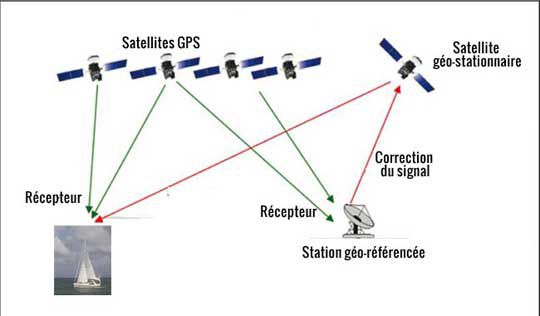

Le **GPS** est aujourd'hui couramment utilisé, notamment dans les véhicules pour guider les déplacements ou dans des applications pour téléphone mobile.

Source : [Wikimedia](https://fr.wikipedia.org/wiki/Global_Positioning_System#/media/Fichier:ConstellationGPS.gif)

Cependant, à la base, il sagit d'un système complexe de positionnement en temps réel mis au point par les USA, basé sur une constellation de satellites, qui était à l'origine réservé à une utilisation militaire. En 2000, le président Bill Clinton confirme sa vocation pour les usages civils et rend possible le développement d'appareils grand public.

Source : [Bateaux](https://www.bateaux.com/article/22398/comprendre-fonctionne-gps)

Depuis, les technologies se sont améliorées pour rendre sa précision plus grande, avec de nouveaux réseaux de satellites (Galileo pour l'Europe, GLONASS pour la Russie, Beidou-Compass pour la Chine, et d'autres) et des techniques de comparaison de données sur plusieurs récepteurs (GPS différentiel).

Source : [Wikipedia](https://fr.wikipedia.org/wiki/GPS_diff%C3%A9rentiel#/media/Fichier:Dgps1.jpg)

Concrètement, pour les SIG, les données GPS ont permis d'acquérir de l'information spatiale rapidement, partout dans le monde et avec un niveau de qualité croissant. À partir de relevés GPS, on obtient des données vectorielles : points, lignes et polygones, parfois aussi avec l'altitude, que l'on peut facilement intégrer dans un SIG. Ces données sont généralement *non projetées* mais fournies dans un système de référence spatiale normalisé, souvent le [WGS-84](http://epsg.io/4326).

C'est la disponibilité croissante de données issues de GPS automobiles qui a permis de lancer le projet de cartographie participative mondiale [OpenStreetMap](https://www.openstreetmap.org/).

Sur le terrain, des professionnels peuvent utiliser des appareils de mesure précise des angles qui permettent, une fois calés sur des points de référence (géodésiques), de trianguler une zone pour en tracer des plans très précis : géomètres, archéologues, conducteurs de travaux...

Tachéomètre [Source](https://fr.wikipedia.org/wiki/Tach%C3%A9om%C3%A8tre#/media/Fichier:Tachymeter_vooraanzicht.jpg)

Ces appareils se composent d'outils de mesure des angles comme les tachéomètres ou théodolites et des outils de mesure de distance comme les télémètres laser. Avec ces mesures, on construit une série de triangles avec l'aide des théorèmes classiques de géométrie (Pythagore, Thalès...) et on peut ainsi progressivement couvrir des surfaces à mesurer, très précisément.

Triangulation [Source](https://fr.wikipedia.org/wiki/Triangulation_de_Delaunay#/media/Fichier:Delaunay_Triangulation_(100_Points).svg)

Le grand projet de triangulation de l'Inde [Source](https://fr.wikipedia.org/wiki/Great_Trigonometrical_Survey)