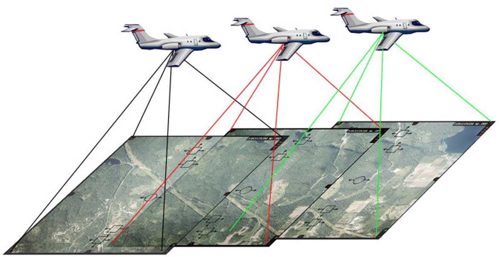
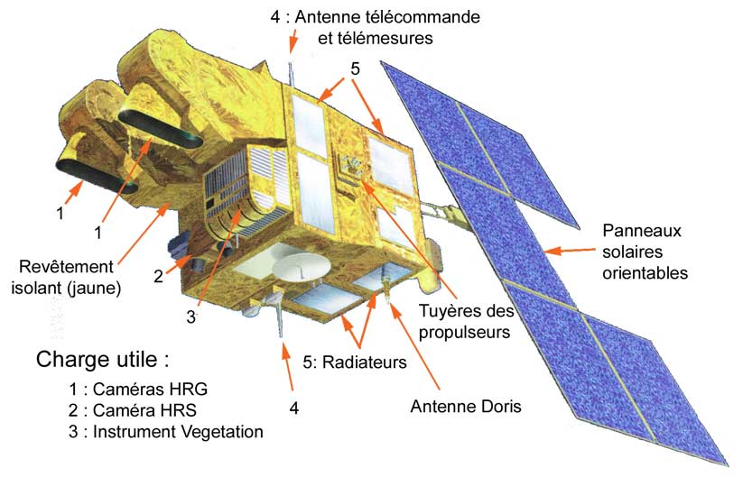

## Généralités

L'imagerie aérienne et spatiale produit des données géographiques, principalement sous la forme de **rasters**. Le pixel correspond alors à l'unité élémentaire d'information, sa valeur aux caractéristiques du capteur utilisé (longueur d'onde radiométrique, canaux).

Très souvent, les images doivent être *redressées* (car prises selon un angle), *rectifiées* (mises à plat des déformations dûes au relief) et *corrigées* (harmonisation, calibrage des valeurs, supression des nuages...) avant utilisation. Elles sont aussi, naturellement, **géoréférencées**, c'est à dire placées dans un système de référence spatiale qui leur donne une position et des dimensions précises, pour pouvoir les intégrer à un système d'information géographique.

Selon leur résolution, leur format numérique et leur nombre, les données d'imagerie peuvent représenter des tailles de fichier variés, mais elles sont généralement bien plus volumineuses (et donc coûteuses à gérer informatiquement) que les données vectorielles, qui sont plus abstraites. Par exemple, une image Pléiades de 20km x 20 km et de 50cm de résolution sur 8bits correspond à environ 1,6 million de pixels et représente *6Go de données* au format GéoTIFF.

## La photographie aérienne

La **photographie aérienne** a révolutionné la cartographie topographique au début du XXe siècle, en permettant de mettre à jour bien plus rapidement les cartes que par des levés de terrain.

Principe de la photographie aérienne (Source : IGN)

Aujourd'hui, les photographies verticales prises d'avion sont toujours utilisées pour la mise à jour des informations des bases de données topographiques, notamment par [l'IGN](http://www.ign.fr/images-satellitaires-et-defense?taget=blank) en France. Elles sont complétées par les images satellite.

Les photographies aériennes fournissent des données raster, composées de pixels, dont les valeurs correspondent à la couleur "naturelle" des objets survolés, après rectification et correction des couleurs des photographies. Elles sont aujourd'hui directement acquises dans un format numérique, mais il existe de volumineuses archives de photographies papier et film qui sont progressivement numérisées et mises à disposition, notamment sur le [Géoportail](https://www.geoportail.gouv.fr/donnees/photographies-aeriennes) IGN et sur le site dédié ["Remonter le temps" de l'IGN](https://remonterletemps.ign.fr/).

Récemment, la mise au point de **drones** performants pour la prise de vue a rendu possible l'acquisition d'images aériennes plus simple, notamment avec des capteurs radar, infra-rouges et LIDAR, pour l'archéologie, les travaux publics, la gestion des forêts, etc.

## Les images satellite

Par rapport à la photographie aérienne, la capture d'images de la Terre depuis un satellite permet de couvrir des surfaces plus grandes, avec une fréquence de retour sur zone plus rapide et en utilisant des capteurs plus variés.

Les satellites d'observation de la Terre, autrefois réservés à des usages militaires, sont depuis quelques décennies utilisés dans un cadre civil et utilitaire. De résolution à l'origine assez faible (30m pour Landsat en 1972, 10m pour SPOT-1 en 1986), on en arrive de nos jours à des résolutions très fines qui les rapprochent de celles des photographies aériennes (Pléiades, DigitalGlobe ou GeoEye proposent des images de résolution de moins de 50cm).

Le satellite Spot-5 (Source: Pline pour WikiCommons)

Des sociétés commerciales viennent aujourd'hui concurrencer les administrations publiques pour le lancement et l'exploitation de satellite d'observation de la Terre, tant les données spatiales (à double titre !) produites sont utiles. En effet, outre les couleurs "naturelles" que ces images peuvent poposer, les satellites possèdent souvent des capteurs prévus pour des longueurs d'onde complémentaires, comme les infrarouges qui offrent plus d'information sur l'activité des plantes et les températures ou le radar qui mesure des distances et cartographie les reliefs directement.

Des images d'exemple sont disponibles dans les liens de [la page de ressources](../../intro/ressources).