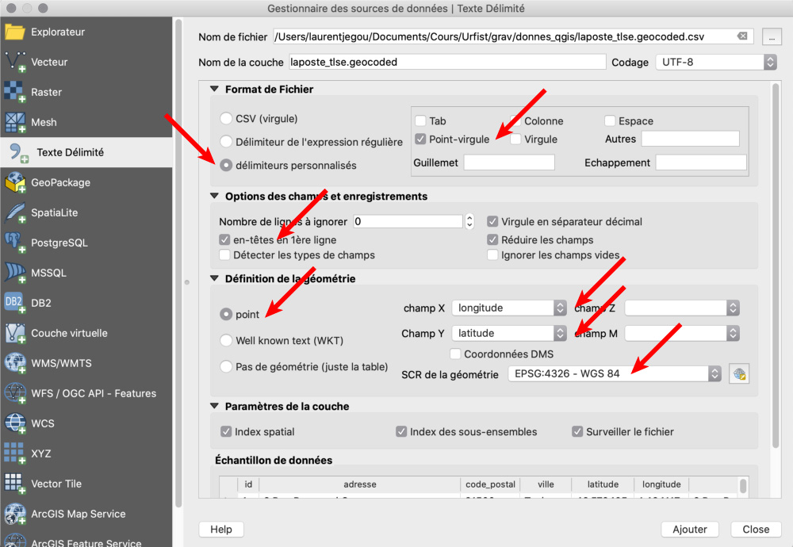

## Introduction

Très souvent, les données spatiales sont disponibles sous une forme inadaptée à l'usage dans un SIG, il faut alors les convertir.

Un des cas les plus courants est celui où l'on a besoin de localiser des points, mais que les informations spatiales ne sont fournies que sous la forme de colonnes de texte contenant des coordonnées. On peut citer l'exemple de relevés faits sur le terrain, par des naturalistes ou des agents de terrain qui ne dispsent pas d'équipement de relevé autre qu'un simple GPS.

Il faut alors repérer les colonnes d'information contenant les coordonnées et demander à QGIS de les convertir en entités spatiales complètes.

## Exemple avec QGIS

C'est assez simple à réaliser avec QGIS, c'est une des possibilités d'ajout de couche à un projet. Nous allons utiliser le fichier d'exemple fourni dans [les données accompagnant](http://www.geotests.net/cours/urfist/QGIS/) la présente formation : **laposte_tlse.geocoded.csv**

Il s'agit d'un fichier de données alphanumériques (lettres et chiffres), au format CSV (*comma separated values*, ie. des colonnes séparées par des points-virgules). C'est en fait le résultat d'un géocodage automatique de données avec la Base Adresse Nationale, que nous expérimenterons plus loin.

Pour ouvrir et convertir ce fichier en une couche de points localisés dans QGIS, il faut réaliser les opérations suivantes :
* Créer ou ouvrir un projet QGIS adapté (notamment au niveau de la projection, ici Lambert-93)
* Via le menu "couche", choisir **d'ajouter une nouvelle couche de texte délimité**
* Paramétrer cet ajout pour prendre en compte les colonnes contenant les coordonnées :
	* **Délimiteurs personnalisés**, points-virgules (car le CSV utilise des virgules, normalement)
	* Les en-têtes (noms des colonnes, des champs d'information) sont en première ligne
	* La géométrie consiste en des **points**, dont les coordonnées sont dans les champs longitude (X) et latitude (Y)
	* Ces coordonnées ne sont pas projetées, car l'équivalement d'un résultat GPS, dont le système de référence spatiale est le **WGS84, EPSG:4326** (on fait confiance à QGIS pour les ajouter à un projet qui, lui, est projeté en Lambert-93 France).

Le résultat, si on utilise le projet précédemment créé lors de l'ouverture des données vectorielles des polygones des EPCI de Midi-Pyrénées, doit montrer les nouveaux points dans la commune de Toulouse.

