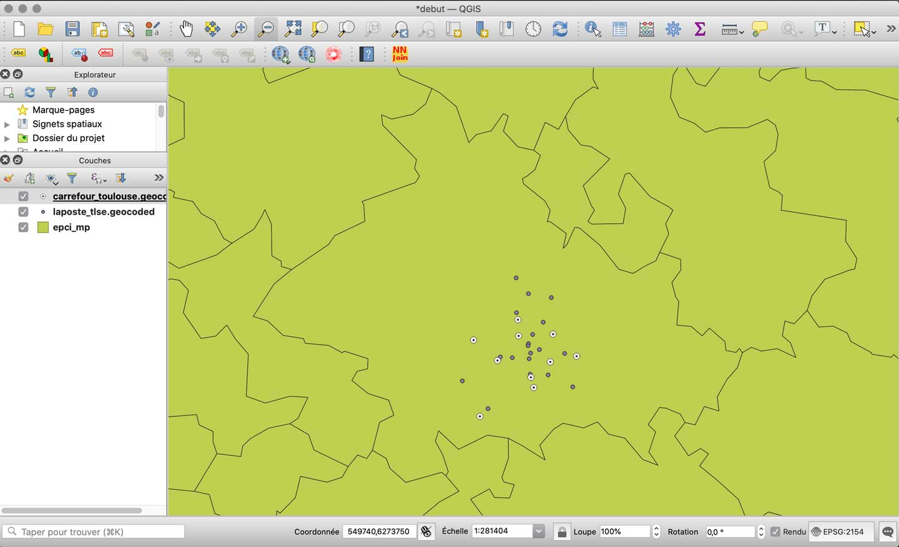

## Introduction

Le *géocodage* est l'opération qui permet d'ajouter une information spatiale à des données *textuelles* classiques, en repérant à l’intérieur des textes les composantes géographiques, de localisation : adresses, toponymes, lieux connus.

Cette technique est beaucoup utilisée, par exemple, en géo-marketing pour convertir des listes d’adresses en points géomatiques.

En France, la Base d’Adresses Nationale (collaboration La Poste - IGN), propose des outils en ligne : [https://adresse.data.gouv.fr/tools](https://adresse.data.gouv.fr/tools?target=blank)

Dans le monde, plusieurs solutions existent, en commercial avec Google, Microsoft, ou via des services multi-bases comme [https://locationiq.com/](https://locationiq.com/?target=blank). Dans le domaine du libre, on peut aussi utiliser les ressources d’OpenStreetMap avec la base [Nominatim](https://nominatim.org/?target=blank) (qui est utilisée par LocationIQ, entre autres).

## Géocodage avec la BAN

Rendez vous sur la page de l’outil en ligne d'importation de CSV de la BAN  : [https://adresse.data.gouv.fr/csv](https://adresse.data.gouv.fr/csv)

Importez le fichier des enseignes Carrefour à Toulouse : carrefour_toulouse.csv (dans les [données fournies](http://www.geotests.net/cours/urfist/QGIS/)).

* Dépôt du fichier sur la page de l'outil
* Choisir (bouton +) uniquement les colonnes : adresse, code postal, commune
* Lancer le géocodage (bouton)
* Télécharger le résultat (bouton)
* Ajouter ce fichier CSV comme une nouvelle couche dans le projet QGIS en cours.

