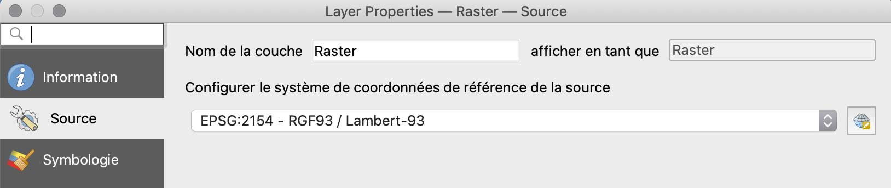
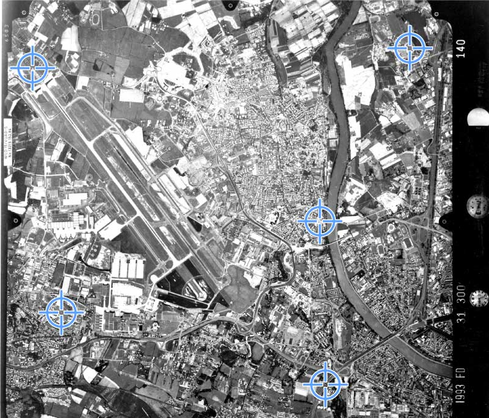
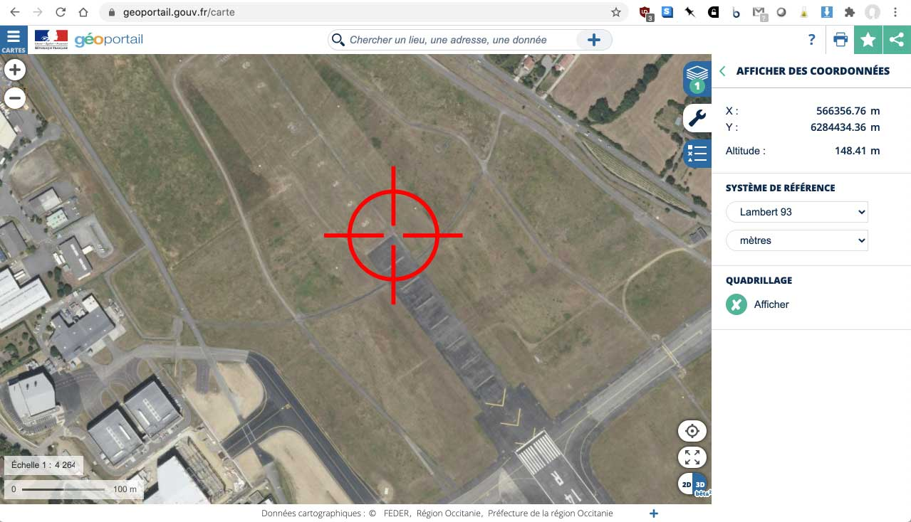
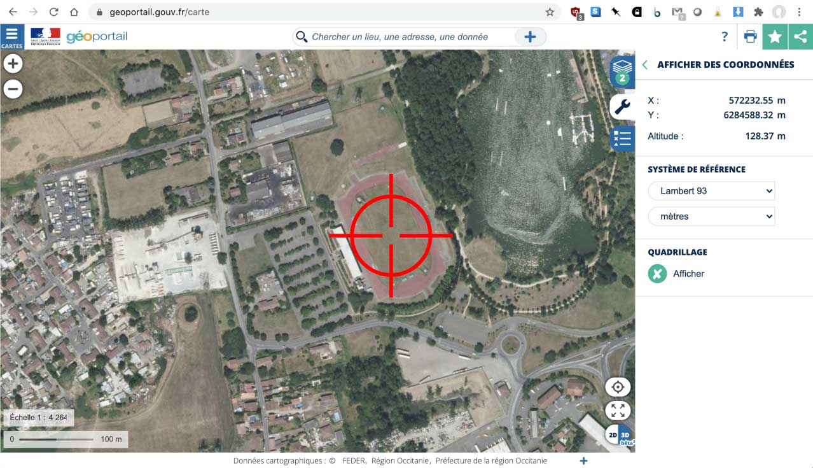
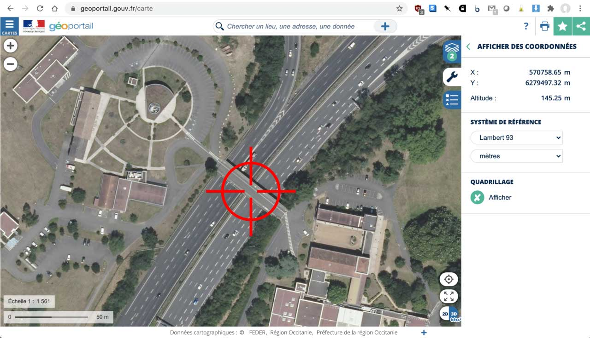
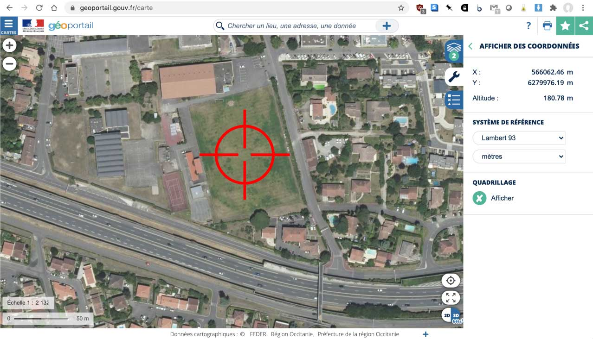
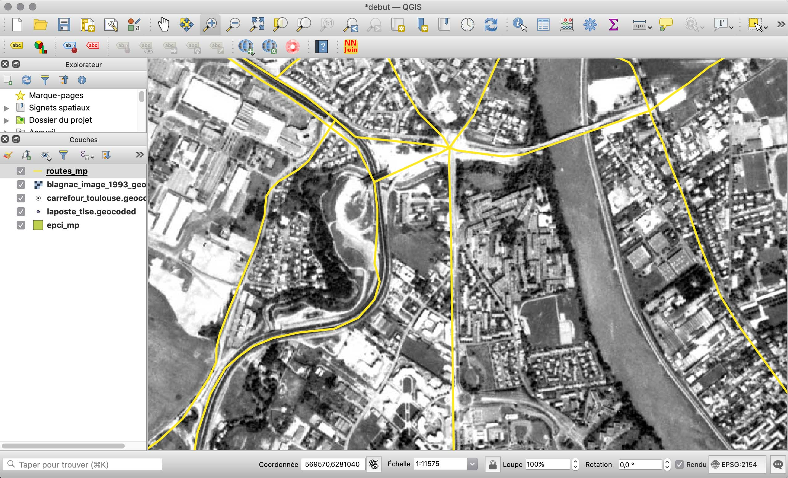

## Introduction

QGIS possède une fonction très puissante qui permet de géoréférencer, de *caler* une image en précisant les coordonnées de points de repère qu’elle contient : le géoréférenceur, accessible via le Menu « Raster » puis « Géoréférencer »

En précisant à QGIS les coordonnées de ces points de repère, connues par ailleurs (carte topographique, photo calée, relevé GPS, couche SIG de référence...), le logiciel va caler l’image dans l’espace, lui affecter une projection et, éventuellement la déformer pour faire correspondre l'image à l'affichage du projet géoréférencé.

## Pratique avec QGIS

* Caler une image, ou la géoréférencer, c’est lui affecter un système de coordonnées de référence (SCR) en trouvant des points de repère dans l’image dont on peut connaitre les coordonnées dans une couche de référence (points d'amer).
* Dans le menu « **Raster** », ouvrez l’outil « **géoréférencer** » (si absent, installez l’extension « Géoreferenceur GDAL »).
* Dans  le référenceur, ouvrez l’image blagnac_image_1993.jpg : [http://www.geotests.net/cours/urfist/QGIS/blagnac_image_1993.jpg](http://www.geotests.net/cours/urfist/QGIS/blagnac_image_1993.jpg)
* Spécifiez le système de coordonnées de référence (SCR) « Lambert 93 » (le système officiel français)

On va caler cette photo aérienne de 1993 de l'IGN en trouvant les coordonnées de points de référence sur le Géoportail : [http://geoportail.gouv.fr](http://geoportail.gouv.fr). Il est aussi possible de caler une photographie directement à partir d'un fond de carte chargé dans QGIS, par exemple un fond de carte web comme OpenStreetMap (accessible via l'extenxion *QuickMapServices*, par exemple, on y reviendra). Dans ce cas, il n'est pas nécessaire de saisir des coordonnées, il faut cliquer sur le point correspondant sur le fond, en ayant pris soin de zoomer assez près pour être un minimum précis.

Pour aller plus vite, la photo. aérienne de Blagnac de 1993 est fournie avec des points déjà calés, dans le fichier blagnac_image_1993.jpg.points, du répertoire ZIP de données fournies, que QGIS peut reconnaître et utiliser automatiquement.

### Saisie des points de repère

Une fois ouverte, il faut préciser la projection de travail de l'image, par le menu "Paramètres", puis "Propriétés du raster", et enfin l'onglet "Source" pour choisir le Lambert-93.

Pour caler chacun des points, il faut d'abord trouver ses coordonnées géographiques sur la carte ou la photographie aérienne de référence du GéoPortail IGN. Il faut choisir les points de référence selon deux critères :
* leur répartition équilibrée dans l'image, sur les bords et au centre ;
* la facilité avec laquelle retrouver ces points sur une photographie aérienne récente du GéoPortail (donc plutôt utiliser des éléments stables du paysage, comme les ponts, les bâtiments anciens, etc.).

Voici ceux que l'on va utiliser pour l'image de Blagnac en 1993 :

Dans le géoportail, il faut choisir la commune, Blagnac, puis la couche des photographies aériennes, zoomer sur le bout de la piste de l'aéroport et, dans le menu des outils à droite (icone clé), choisir d'afficher les coordonnées en Lambert-93.

* Pt. n°1 : le bout de la piste de l’aéroport, au NO de l’image, sur le GéoPortail.

Coordonnée X :  566 356 m  
Coordonnée Y :  6 284 434 m

Ensuite, il faut saisir ce point dans le géoréférenceur de QGIS et lui attribuer les coordonnées Lambert-93 trouvées.

* Pt. n°2 : le centre du stade de Sesquières, au NE de l’image, sur le GéoPortail.

Coordonnée X :  572 233 m  
Coordonnée Y :   6 284 588 m

Saisie dans le géoréférençeur de QGIS :

* Pt. n° 3 : le centre du pont de Purpan sur la rocade, au SE de l’image, sur le GéoPortail.

Saisie dans le géoréférençeur de QGIS :

Coordonnée X :        570 759 m  
Coordonnée Y :     6 279 497 m

* Pt. n°4 : le centre du stade du collège de Colomiers, au SO de l’image, sur le GéoPortail.

Coordonnée X :       566 062 m  
Coordonnée Y :    6 279 976 m

Saisie dans le géoréférençeur de QGIS :

* Pt. n°5 : le centre du rond-point de la pace Plan du Port, à Blagnac (qui donne sur le pont de Blagnac, au centre-droit de la photographie aérienne).

Coordonnée X : 570 780 m  
Coordonnée Y : 6 281 952 m

Saisie dans le géoréférenceur QGIS :

### Création du géoréférencement

Nous pourrions ajouter d'autres points de calage, répartis dans l'image, pour améliorer un peu la qualité du géoréférencement. Cependant, comme notre image est une photograhie aérienne déjà rectifiée, elle ne comporte normalement que peu de déformations et ne nécessite pas de gros efforts pour être calée. Dans le cas d'image de source plus brute, comme des photos tirées de drones ou de scans, il sera utile de choisir plusieurs points de repère bien répartis dans l'image.

Le rôle de l'outil de géoréférencement de QGIS est de produire une image comportant des informations de géoréférencement à partir de notre source en JPEG et de nos points de repère. On va paramétrer cette transformation via le menu **Paramètres** puis **Paramètres de tranformation** de l'outil.

Explication des paramètres de transformation :

* Étant donnée la qualité de la source, nous allons utiliser une *transformation simple*, sans déformation complexe, [de type "Helmert"](https://fr.wikipedia.org/wiki/Transformation_de_Helmert), qui utilise des translations, rotations et mises à l'échelle.
* La source étant une photographie, qui va être pivotée et légèrement étirée par la transformation, on va ensuite choisir un *rééchantillonage* (la méthode de calcul des couleurs des nouveaux pixels nés de la transformation) de type *cubique* pour que les couleurs soient lissées sur les pixels créés. Si la source avait été une carte topographique, on aurait du choisir la méthode des "plus proches voisins" pour éviter que les couleurs soient dégradées (lissées) sur les nouveaux pixels (et garder des transitions franches entre les divers objets ou symboles de la carte).
* En sortie, on va demander la génération d'un format *GeoTIFF*, compressé en LZW, ce qui produit un fichier image contenant le géoréférencement et d'un format courant, pas trop volumineux.

On peut ensuite lancer la transformation en cliquant sur la flèche verte de la barre d'icônes, ou via le menu "Fichier" puis "Débuter le géoréférencement".

Le tableau de valeurs des points indique des erreurs entre 5 et 20 pixels, ce qui n'est pas énorme étant donné notre repérage sur une photographie relativement ancienne.

Lorsque l'on regarde l'image référencée chargée dans le projet QGIS, par exemple en comparant avec la couche vectorielle des routes principales (routes_mp.shp), on constate la relative bonne qualité du calage, notamment sur les ponts de la Garonne et de la rocade.

