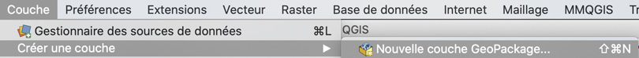
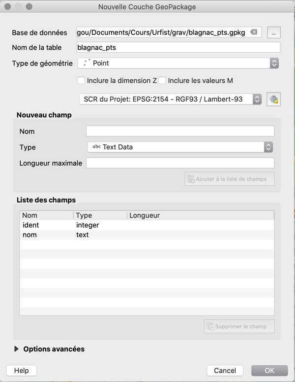
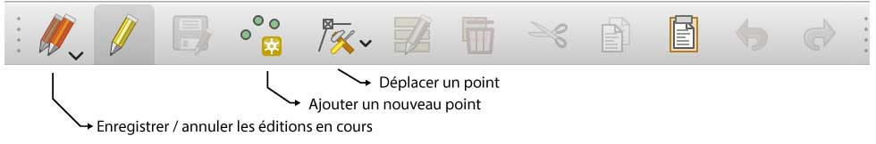

## Préparation du fond de référence

La **saisie** directe dans QGIS est possible, en ayant au préalable chargé une couche de référence qui va guider le dessin des formes vectorielles, un peu comme si l'on allait *décalquer* des objets vectoriels.

Une photographie aérienne géoréférencée, comme réalisé à [l'étape précédente](../georeferencer/), peut notamment servir de fond.

L'autre possibilité est d'utiliser une source externe, comme des fonds de carte issus de **services web de tuiles**. Il en existe plusieurs, qui sont facilement accessibles grâce au plugin ["QuickMapServices"](https://plugins.qgis.org/plugins/quick_map_services/?target=blank).
*Attention* cepandant, ces services web étant fournis dans une projection spécifique (souvent Mercator), leur utilisation à petite échelle cartographique posera vite problème.

Chargeons dans notre projet la couche "OSM Standard" du menu "OSM" du plugin :

Et restons au centre-ville de Blagnac :

## Saisie de points, lignes et polygones

### Préparation à la saisie de points

La saisie de nouvelles données spatiales suppose d'avoir au préalable prévu la couche d'information qui va les recevoir, donc d'avoir créé une nouvelle couche adaptée (type de géométrie et projection).

On créer une nouvelle couche par le menu "Couche", puis "Créer une couche" et "Nouvelle couche géopackage" : 

Nous allons commencer par saisir des données à la géométrie ponctuelle, des points d'intérêt (POI) sur Blagnac, donc on peut utiliser le classique format GeoPackage et la projection Lambert-93. Il faut aussi préciser quelles vont être les informations attributaires associées à ces points, sous la forme de champs de la table d'attributs.

Il faut au minimum un champ d'identification (de type nombre entier) et un champ de dénomination, au format texte.

On obtient la fiche de paramétrage de la nouvelle couche suivante :

Elle se charge automatiquement dans QGIS, mais ne contient pas encore de données, que nous alllons saisir "manuellement", une par une, en cliquant sur le fond pour la partie géométrique et en remplissant un formulaire pour la partie attributaire.

Pour réaliser cette saisie, il va falloir utiliser des outils adaptés, dont on fait apparaître la barre d'icône en allant dans le menu "**Vue**", puis "Barres d'outils" et enfin "Numérisation" :

On obtient la barre d'icônes suivante :

Notez que toutes les icônes sont inactives sauf la deuxième, celle qui représente un crayon jaune.

> **C'est du à une fonction de sécurité importante : ** Les modifications dans les données d'une couche ne sont possibles que s'il l'on a d'abord ouvert cette couche à la possibilité d'être éditée, qui s'appelle, dans QGIS, le "**mode édition**".

Ainsi, si l'on veut pouvoir ajouter de nouvelles données, de nouveaux points et leurs attributs dans le cas présent, il faut activer le "mode édition" au préalable, *en cliquant sur cette icone au crayon jaune*". Cela rend disponible les autres outils de saisie, active les autres icônes de la barre de numérisation :

### Saisie de points

Pour saisir un nouveau point, il faut donc :
* zoomer sur la zone de manière à placer le point avec la précision voulue ;
* choisir l'outil d'ajout d'un nouveau point dans la barre d'icônes ;
* cliquer sur la carte à l'endroit désiré ;
* saisir les attributs de ce nouveau point, ici son identifiant et son nom.

### Préparation à la saisie de polygones

Pour créer une nouvelle couche de polygones, la procédure est la même, via le menu "Couche", "Créer une nouvelle couche" :

Cette fois, bien sûr, il faut changer le type d'entités pour des polygones, mais on prévoit toujours un champ d'identifiants et un champ de noms, au minimum (ici on a ajouté un champ texte pour pouvoir renseigner les fonctions des bâtiments que l'on va saisir).

### Saisie de polygones

La saisie de polygones se réalise selon le même principe que pour les points, notez que l'ordre de saisie est important pour que la série de points forme un polygone régulier (surtout, ne pas croiser les segments entre eux). Une fois le dernier point cliqué, il faut effectuer un **clic-droit** pour signaler que l'on veut terminer le polygone, le dernier segment qui va relier le dernier au premier point se dessinera alors automatiquement.

