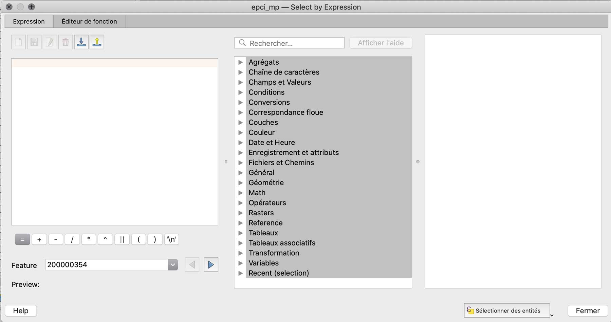
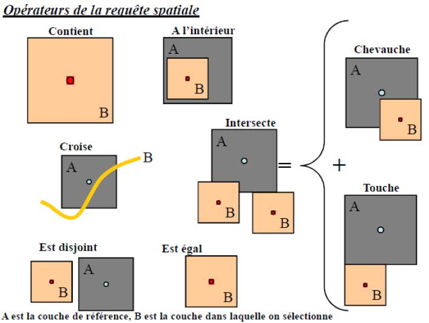
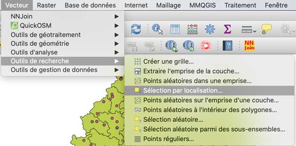

La recherche des données est une fonctionnalité centrale des systèmes d'information. Les SIG ajoutent la dimension spatiale à ces possibilités, c'est à dire la capacité de rechercher des informations sur des critères géographiques, utilisant la position (respectivement à des références géographiques ou à d'autres couches), des relations géométriques ou des mesures dans l'espace.

## Requêtes attributaires

La recherche d'informations peut, dans une première approche simple, concerner seulement les attributs des données spatiales. On se retrouve alors dans le cadre des requêtes classiques des bases de données.

QGIS offre la possibilité de réaliser ce type de recherches de plusieurs manières : par *formulaire* dans la table des attributs, pour trouver ou filtrer rapidement des informations, ou par *expressions*, qui peuvent être plus complexes. (Nous avons déjà croisé le générateur d'expressions lors des [calculs de nouveaux champs](../calculer-des-donnees)).

### Recherche d'un EPCI par son nom

Lorsque l'on connait la valeur attributaire recherchée, par exemple le nom d'un élément de la couche, on peut assez simplement utiliser la possibilité de filtrer directement l'affichage de la table attributaire, en utilisant l'outil de filtrage simple.
Le formulaire de filtrage rapide propose, de plus, l'auto-complétion des critères de recherche, basée sur le contenu réel du champ dans la couche active, ce qui facilite leur saisie.

Les boutons du bas de la fenêtre servent à préciser l'action à réaliser sur les entités résultat du filtre : clignotement, zoom, sélection (ajout / suppression à la sélection en cours), filtrage (sélection au niveau de la source de données).

Il est aussi possible d'utiliser la fonction de sélection par expression : 

### Recherche des EPCI avec de fortes croissances d'emplois entre 2013 et 2018

Pour réaliser cette recherche, on peut utiliser le même outil de filtrage, mais avec un critère sous la forme d'une courte expression.

## Requêtes multi-tables avec critères spatiaux

La prise en compte de critères spatiaux permet de croiser des données spatiales entre elles en utilisant des relations liées à la géographie. Ces relations sont définies par un modèle de référence, qui est utilisé par la plupart des logiciels de SIG, le [DE-9IM](https://en.wikipedia.org/wiki/DE-9IM) (*Dimensionnally Extended Nine Intersection Model*) de Clementini et Di Felice (cf. [le document de J-C Proteau](http://www.geoinformations.developpement-durable.gouv.fr/fichier/pdf/Predicats_OGC_V3_cle119417.pdf?arg=177828548&cle=baf65cf1b040772ae1d97f164cf9ca67f6dbb698&file=pdf%2FPredicats_OGC_V3_cle119417.pdf) pour plus de détails, en français).

Les relations spatiales (dites "topologiques") qui en découlent sont les suivantes, avec un vocabulaire bien défini mais qui peut porter à confusion pour les débutants :

Source : [ENTE-Aix, ENSG](https://www.ente-aix.fr/documents/164-QGIS/07_selection/co/30_N1_ext_req_saptiale.html).

### Pratique avec QGIS : les EPCI sans piscines

La politique d'aménagement du territoire essaye de développer des équipements publics de manière équilibrée. En rapport avec la volonté pédagogique et de santé publique d'apprendre à nager à tous les jeunes enfants, l'État a cherché à optimiser la présence de piscines publiques sur le territoire, accessibles par les écoles et selon le niveau d'organisation territoriale des intercommunalités (EPCI).

Pour ce faire, des recherches d'informations géographiques basées sur des requêtes spatiales sont faciles à mettre en œuvre avec QGIS.

* Charger la couche de données vectorielles des piscines publiques de Midi-Pyrénes en 2015 : ***piscines_mp.shp*** (source Inventaire des équipements sportifs, DRDJS, 2015).
* La positionner par-dessus la couche des EPCI (glisser-déposer à la souris dans l'onglet des couches)
* Dans le menu "Vecteur", choisir "Outils de recherche", puis "Sélection par localisation"

* Dans cette fenêtre, paramétrer la recherche pour sélectionner tous les EPCI qui ne comportent pas de piscine, ce qui se traduit en langage topologique par : "dont les entités vectorielles sont disjointes de celles des piscines".

Si l'on veut ajouter un critère de distance à ces opérateurs topologiques, à ces requêtes spatiales, il faut passer par un intermédiaire : la création de nouvelles entités spatiales étendues selon un paramètre de distance, les **zones tampon** (ou *buffers* en anglais, que l'on a croisé dans les exemples de traitements SIG au début du présent chapitre).

### Pratique avec QGIS : les écoles à plus de 10km d'une piscine publique

Pour poursuivre notre exemple de l'interrogation sur l'accessibilité des élèves aux piscines, nous allons, cette fois, utiliser non pas la couche de points des écoles, mais un nouvelle couche correspondant aux surfaces se situant à moins de 10km d'une piscine, pour pouvoir ensuite croiser avec la couche des écoles.

* Charger la couche des écoles primaires de Midi-Pyrénées : ***ecoles_mp.shp*** (source : INSEE, BPE).
* Créer une nouvelle couche contenant les zones tampons de 10km autour des **piscines** :
	* Menu "Vecteur", "Outils de géotraitement", puis "Tampons"
	* Paramètres : couche des piscines, 10 kilomètres et *regrouper le résultat* (ce qui permet de fusionner tous les tampons superposés en une seule entité polygonale).

* Enfin, avec le même outil de recherche spatiale "Sélection par localisation", on peut trouver les écoles se situant en-dehors de la zone des 10km autour des piscines (177 sur 472).

