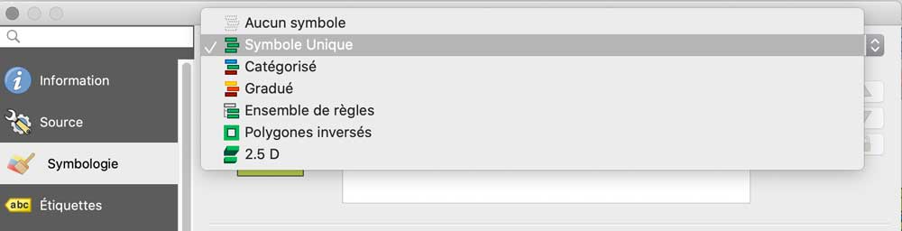
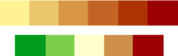

## Introduction
La cartographie thématique vise à représenter graphiquement, sur un fond de carte, un phénomène thématique.

Dans le cadre d'un SIG, ce phénomène peut prendre la forme d’une variable statistique, qualitative ou quantitative, stockée dans les attribus d'une table ou calculée.

La cartographie thématique possède une méthodologie bien définie, qui permet d’obtenir des représentations *efficaces* : la sémiologie graphique.

## Ressources

* Lambert N. et Zanin C. (2016). **Manuel de cartographie**. Principes, méthodes, applications. Paris : Armand Colin, coll. « Cursus : Géographie », 224 p.
* **Cours en ligne**, UOH : http://goo.gl/s56JkN
* **Logiciels et leurs documentations**
	* Magrit (gratuit, en ligne) : [http://magrit.cnrs.fr](http://magrit.cnrs.fr)
	* Philcarto (gratuit) : [http://philcarto.free.fr/](http://philcarto.free.fr/)
	* Khartis (gratuit, en ligne) : [https://www.sciencespo.fr/cartographie/khartis/](https://www.sciencespo.fr/cartographie/khartis/)
* [**Collection de cartes avec des erreurs, à critiquer**](http://www.geotests.net/depot/problemes_carto/)  

   

## Méthodologie simplifiée

Pour présenter les bases de la méthodologie, dans le cadre d'une utilisation avec QGIS sur des données quantitatives, nous allons utiliser la structure suivante :
* **Étudier la variable à représenter**, son type, pour déterminer le type de carte à réaliser
* En fonction du type, **choisir le style de couche à utiliser**
* **Paramétrer** le style de couche

**Le type de la variable conditionne le type de représentation cartographique**

En cartographie thématique, il existe deux grands types de représentations principaux, accessibles avec un logiciel de type SIG : les **plages de couleurs** (ou *chroroplèthes* selon leur nom scientifique) et les **symboles proportionnels**.

D'après les manuels (notamment "La sémiologie graphique", de J. Bertin, référence principale en cartographie) et l'expérience, le choix entre ces deux types de représentation doit se baser sur le type de la variable à représenter, dans le but, toujours, de produire une carte efficace, qui transmette bien et clairement l'information.

Le type de la variable est à déterminer simplement par deux séries de questions : variable quantitative ou qualitative, puis, dans le premier cas, discrète ou continue, dans le second, ordonnée ou nominale.

Ces quatres nivaux d'organisation entre eux des individus de la variable sont hiérarchisés, le niveau quantitatif étant le plus fortement organisé (on peut établir des relations quantitatives précises), le niveau nominal le plus faiblement (on peut juste établir une différence entre les individus, mais rien d'autre).

À partir de cette détermination, on peut croiser ces niveaux avec les outils de dessin cartographique à notre disposition pour *représenter* les individus de la variable sur une carte, ce que Bertin appelle des "variables rétiniennes" (ou variables graphiques, moyens d'exspression).

Pour résumer, on peut utiliser le schéma suivant :

> On notera *la relation centrale qui lie le type de variable au type de représentation* : **si la variable est quantitative discrète (comme des comptages), il faut utiliser des symboles proportionnels. Si elle est quantitative continue ou qualitative ordonnée, on doit utiliser des gammes de couleurs.**

Tout repose sur la propriété la plus importante de la variable à représenter, son niveau d'organisation :
* les **quantités**, alors il faut utiliser des **symboles** qui traduisent graphiquement et directement ces différences de quantité ;
* l'**ordre** entre les individus, alors les **dégradés de couleur** sont plus adaptés, on compare rapidement des nuances entre elles (si elles ne sont pas trop nombreuses ou semblables).

Naturellement, aujourd'hui, certaines variables graphiques proposées par J. Bertin dans les années 1970 ne sont plus beaucoup utilisées (grain, orientation), car leur efficacité est faible, surtout en rapport avec la beaucoup plus grande facilité et accessibilité de l'utilisation des dégradés de couleur (variables visuelles de valeur et de couleur).

## Application dans QGIS

Le logiciel QGIS permet de réaliser les deux types principaux de représentation, symboles et couleurs, dans de bonnes conditions, avec un paramétrage adapté et complet.

Réaliser une cartographie thématique revient en fait, dans QGIS, à *appliquer un style d'affichage sur une couche*, en utilisant l'onglet **"symbologie"** des proproétés de cette couche. Les données attributaires devant être représentées doivent donc faire partie de la couche (les joindre au besoin, comme [vu précédemment](../../traitement/joindre-des-donnees)).

### Les types de cartes thématiques dans QGIS, les styles de "symbologie"

* **Symbole unique** : un même symbole, mais que l’on peut faire varier de taille, pour produire une carte en symboles proportionnels. Correspond à la variable rétinienne de taille et donc à des données quantitatives discrètes. Exemple : une population, un comptage en valeur absolue.

* **Catégorisé** : variables qualitatives nominales ou ordonnées, variation de forme ou de couleur, une couleur par valeur. Exemple : une couleur par type d’intercommunalité différente, par niveau de variable ordonnée comme le statut administratif, la qualité des eaux, etc.

* **Gradué** : variables quantitatives ordonnées, regroupées en classes, variation de la valeur/couleur.Exemple : des variables quanti. relatives, comme un taux d’évolution, un pourcentage, etc.

### Une carte en symboles proportionnels : le nombre d'emplois par EPCI

QGIS est capable de dessiner des symboles proportionnels de plusieurs façons différentes. La plus satisfaisante, car elle produit une légende automatique en mise en page, consiste à utiliser la fonctionnalité **"Diagrammes"** des propriétés de la couche. On va réaliser des diagrammes en secteurs, mais avec une seule valeur, ce qui va produire des cercles proportionnels.

* Rendez-vous dans les propriétés de la couche EPCI_mp21 (clic droit ou menu Couche / Propriétés).
* Cliquez sur l'onglet "Diagrammes".
* Choisissez "Diagrammes en camembert" (secteurs)
* Dans la page "Attributs", placez dans la colonne des "Attributs utilisés" (à droite) uniquement une valeur, celle des emplois au lieu de travail en 2018.
* Vous pouvez changer le style (couleur et contour) du symbole en double-cliquant sur la case colorée de l'attribut choisi dans cette colonne.
* Dans la page "Taille", choisissez une taille variable, basée sur l'attribut représenté, avec un paramétrage pour que la valeur maximale (bouton) soit affectée de la taille de 40km² de surface).
* Vous pouvez cliquer sur "Apply" pour appliquer et visualiser les réglages sans quitter la fenêtre de propriétés.

*À noter* : la légende de la carte n'apparait pas à l'écran, elle ne se dessine que dans un cadre spécifique du composeur de mise en page, que nous verrons [plus loin](../composer-une-mise-en-page).

Les autres techniques pour dessiner une carte en symboles avec QGIS sont moins intéressantes, car elles impliquent une transformation de la couche (générateur de géométrie) ou des opérations complexes (symbole avec remplissage de centroïde), mais c'est parfois indispensable pour réaliser certains types de cartes, par exemple pour pouvoir remplir les symboles avec les couleurs d'une analyse par couleurs (ce qui permet de compenser les fortes valeurs de couleur des petits symboles et d'éviter d'utiliser la surface d'une entité administrative comme support, alors qu'elle n'a pas forcément de sens pour l'analyse).

### Une carte en plages de couleurs : l'évolution des emplois entre 2013 et 2018

Les **cartes en plages de couleurs (choroplèthes)** sont un peu plus complexes à concevoir, car il faut :
* *regrouper les valeurs de la variable en classes* (pour que le légende soit lisible, en évitant un trop grand nombre de couleurs différentes), et
* *choisir une palette de couleurs* qui soit expressive et adaptée au thème.

* Rendez-vous dans les propriétés de la couche EPCI_mp21 (clic droit ou menu Couche / Propriétés).
* Cliquez sur l'onglet "Symbologie".
* Choisissez "Gradué"
* Pour la valeur, choisissez l'évolution relative des emplois entre 2013 et 2018.
* Par défaut, les valeurs de la variable ne sont pas classées, observez l'effet du changement de méthode de classification (la *"discrétisation"* en langage scientifique) en cliquant sur l'onglet "histogramme", qui va afficher un diagramme de fréquences (répartition) des valeurs entre le minimum et le maximum. La hauteur des barres indique le nombre d'individus (ici, des EPCI) pour la valeur. Les barres sont colorées en fonction de la classification et de la palette de couleurs en cours.
* Comme nous avons une variable assez peuplée (plus de 100 EPCI) et la présence de valeurs négatives et positives, on peut augmenter le nombre de classes à 6.
* Ici, il est important de ne pas regrouper dans la même classe, avec la même couleur sur la carte, des valeurs trop différentes (pour ne pas tromper les lecteurs), c'est difficile pour la dernière classe, celle des valeurs les plus élevées, car nous avons un EPCI avec un fort taux de croissance (Frontonnais : +40%). La classification de Jenks ("Ruptures naturelles") semble bien adaptée, avec 7 classes ou plus. 
* Ensuite, il faut choisir une palette de couleurs adaptée : nous avons des valeurs négatives et positives, donc il faut choisir une palette avec deux dégradés, celle nommée "RdYlGn" (pour *red-yellow-green*) est intéressante, mais à l'envers dans notre culture (les verts pour des valeurs positives), il faut donc l'inverser.
* Enfin, on remarque que la troisième classe prévoit de regrouper des valeurs faiblement négatives et positives, autour de zéro ( de -3.2 à +2). Si on garde la couleur vert clair affectée automatiquement, la carte sera menteuse en nous faisant croire à une légère baisse du nombre d'emplois, alors que celui-ci est plutôt stable. On peut donc demander à changer la couleur pour un gris clair neutre, plus intermédiaire.

Pour un résultat plus agréable, il est possible de jouer aussi sur le contour des polygones colorés pour l'atténuer :
* Dans les propriétés de la couche, onglet "Symbologie" et option "Gradué"
* Cliquez sur la barre colorée du symbole
* Dans l'arbre des propriétés de style, en haut de la fenêtre, cliquez sur "Remplissage simple"
* Cliquez sur la barre colorée de la "Couleur de trait"
* Choisissez une couleur avec une opacité plus faible, de l'ordre de 20 à 40 %

La fenêtre d'affichage des couches présente les classes et leurs couleurs, mais ce n'est pas une véritable légende, qui, ici aussi, pourra s'ajouter dans une mise en page. C'est l'objet de notre prochaine leçon.